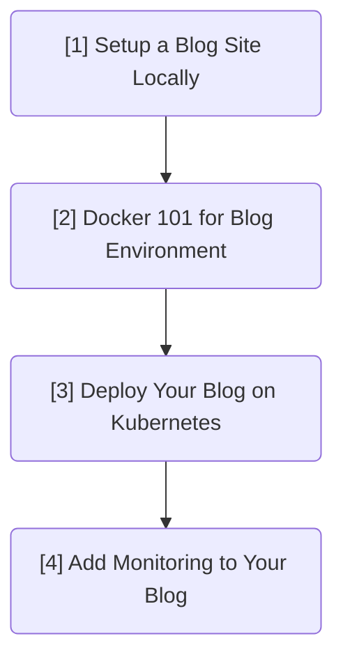

When I first encountered Kubernetes as a junior developer, I was overwhelmed. Previously, programming was more straightforward. 
* For example, when I built a frontend website, I could immediately see the visual results of my code in the browser. 
* Or when I solved LeetCode problems, all I needed was the right algorithm to implement a function that passed the test cases with fixed inputs and outputs. 

But Kubernetes? It felt like a black box filled with abstract terms—containerized workloads, declarative configuration, self-healing clusters. I understood the definitions of those terms literally, but I couldn’t connect with what they actually meant or why they mattered.

If that sounds like your experience, you’re not alone. Kubernetes has a steep learning curve, especially if you haven’t worked with large-scale infrastructure before. I used to find it frustrating and confusing, and that’s okay. If you’ve felt the same way, it’s not your fault—it just means you haven't had the right context yet. This blog series is for giving you the right context to help you understand the Kubernetes depper. 

In this series, we’ll go step by step to build and deploy a personal blog site on a Kubernetes cluster. This is not just a toy example—it’s something you can actually use and extend. Our goal is to package, deploy, expose, and monitor a real blog site.

## Who is this blog for?
* You’ve started learning Kubernetes but still find it abstract
* You’re a developer with some development experience
* You prefer learning through concrete, hands-on examples rather than theory

## Series Overview: What We'll Build Together
Here’s the roadmap:

Uh-oh, already overwhelmed by some of the terms above? No worries. Just forget them for now! Unlike standard documentation, you don’t need to pause and look things up—we’ll explain them clearly when the time comes.

| Blog                                           | Overview                                                                                                                                              | Technology                        |
| ---------------------------------------------- | ----------------------------------------------------------------------------------------------------------------------------------------------------- | --------------------------------- |
| \[1][WIP] Setting up a Blog Site               | Set up a blog development environment on your local machine. This is the foundation for the following blogs.                                          | Jekyll                            |
| \[2][WIP] Using Docker to Simplify Setup       | Use Docker to avoid repeating environment setup across multiple devices. Learn how to build and use Docker images for your blog project.              | Docker, Dockerfile, Images        |
| \[3][WIP] Deploying to Kubernetes              | Publish your blog website on an Azure Kubernetes cluster. Learn how to deploy, expose services, and make the blog publicly accessible with ingress.   | Kubernetes, Ingress               |
| \[4][WIP] Monitoring Your Blog with Prometheus | Add click tracking to your blog using Prometheus. Learn how to deploy multiple services together in a cluster and understand networking between them. | Prometheus, Kubernetes Networking |

## Some last words
Although I’m not a Kubernetes expert, I still wanted to write this series. In fact, not being an expert can sometimes be a strength: I still remember the confusion I had as a beginner, so I try to explain things in a way that would have helped my past self.

I also want to encourage you—even if you're not an expert—to share what you know. You might help someone who's just a few steps behind you.

Of course, this blog series won't cover every corner of Kubernetes. But if it helps you understand even one concept more clearly, that would truly be my honor.

Mistakes are inevitable, and I warmly welcome your feedback. Please don’t hesitate to point them out and help improve the content.

## Next Steps
So if you're ready, let's dive into the first post in the series: [Learning Kubernetes by Building a Blog Site (Part 1): Setup a Blog Site Locally](#WIP)
